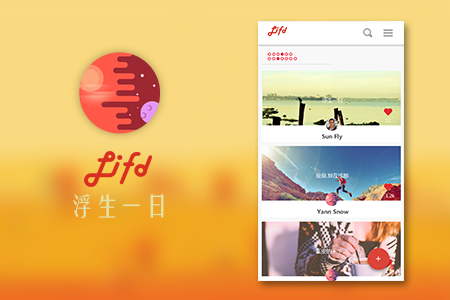
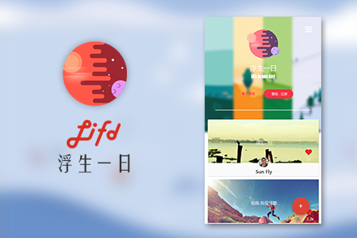
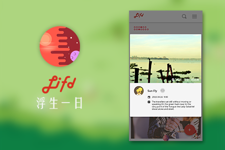

# Moment | 浮生一日

 浮生一日，记录一天最有意义的时光

 A time-limit daily sharing application.

## Features
- Sharing limited only one Image and a paragraph of Text(limited to 200 words maybe), which combination called Moment
- Users can share only one Moment per day
- The Moment will only keep for that day, it will disappear next day.

## Screenshots

## About Team
@ Bukeu Team

- Yao Shenyuan (姚圣源)
- Yin Guangzong (尹光宗) @twocoldz
- Yang Wenyan (阳文彦)
- Max Xu

This project created at 2015.03.26 when we still in Sichuan University.

## Acknowledgement
I got to say, Thank you, all of you guys !

Everyone has done a great job.

Yao always full passion. We need this kind of guy.

Yin does a excellent coding. I love him.

Yang's design is awesome,it's always what I want!
